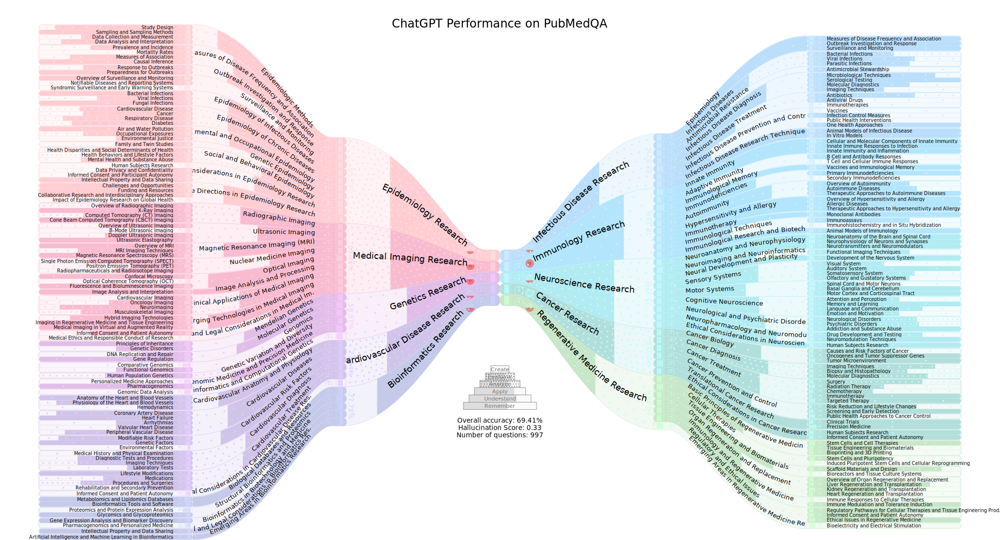

# LLMMaps - A Visual Metaphor for Stratified Evaluation of Large Language Models

[Our paper on Arxiv](https://arxiv.org/abs/2304.00457)

 
Below we show how to use LLMMaps for visualization and how to get a raw QA dataset ready for visualization. 
We provide the processed datasets in the data directory to reproduce all visualizations in our paper. 
These do not contain the original question and answer data, but everything necessary for the visualization. 
The visualization uses the Roboto Condensed to be displayed correctly you need it installed.
All required python packages are listed in `requirements.txt`
## Visualize imported and processed data
First we show our visualization pipeline, with the process to transform raw data given below.
For the visualization to work, we need the .qar, .qaa and .hir files for the respective datasets and models we want to visualize to exist in the data directory and expect the naming convention which results from our other scripts. Then we pass only the model names and dataset names to `tree_vis.py` in the visualization directory. All filenames are build from these. 
An example for this and ChatGPT on PubMedQA is:

    python3 tree_vis.py --llm_models chatgpt --datasets pubmedqa --draw_qna_samples --max_num_stacked_leafs 9 --layer_width 420 --qna_sample_quality high

And an example case for multiple models on SciQ would be:

    python3 tree_vis.py --llm_models chatgpt davinci bloom gpt2 llama13b --datasets sciq --draw_qna_samples --max_num_stacked_leafs 9 --layer_width 250 --qna_sample_quality high

The other figures from our paper could be reproduced with:

    python3 tree_vis.py --llm_models chatgpt --datasets medmcqa --draw_qna_samples --max_num_stacked_leafs 4 --layer_width 450 --qna_sample_quality high
    python3 tree_vis.py --llm_models chatgpt --datasets usbar --draw_qna_samples --max_num_stacked_leafs 15 --layer_width 320 --qna_sample_quality high
    python3 tree_vis.py --llm_models together_bloom together_gpt-j-6b together_gpt-neox-20b together_opt-66b together_opt-175b --datasets wikifact mmlu naturalqa openbookqa --draw_qna_samples --max_num_stacked_leafs 10 --layer_width 210 --qna_sample_quality high

## Controlling the Visualization 

While the default parameters in `tree_vis.py` suffice for obtaining an appealing and informative visualization, there are several parameters to control the setup of the resulting mindmap and it's content (useful e.g. if you need to meet figure constraints for a publication).
Also affecting the computation speed, the first two arguments control the display of sample population in the stratified knowledge fields. The most compute intensive part of the visualization is obtaining the blue noise samples, so `--draw_qna_samples` turns the point sampling and display on, which is turned off per default. In addition, `--qna_sample_quality` controls the sample size in point relaxation and thus the "blue noise quality" os the resulting point sample. Setting this to `high` assures a good blue noise character of the resulting sample but is also slow (the code checks the parameter only for `high` and not `high`). `--draw_empty_leaves` controls the display of stratified knowledge fields in which none of the samples could be assorted. As this is usually a rather large fraction (thus extending vertical size of the resulting figure), it is not done per default, but can give insights to missing samples covering certain subfields when analyzing the model performance to understand it's accuracy in a specific field. `--layer_width` controls the widht of each depth level (thus affecting horizontal size of the resulting figure). Lastly, `--max_num_stacked_leafs` sets the number of child nodes for each given parent node which should be stacked vertically before starting horizontal stacking (thus trading off between vertical and horizontal figure size).

## Importing Own Q&A Datasets

First the Q/A datasets we want to view needs to be formatted into our data format. 
Apart from `import_qa.py`, all script utilize ChatGPT. Thus you need a valid OpenAI API Token and set it in the top of each script. 
For this simply go to data_processing and call `import_qa.py` for the dataset in question. For PubMedQA this would be:

    python3 import_qa.py --path /path/to/pubmedqa/data/ori_pqal.json --target pubmedqa

In general, `import_qa.py` is the only place to adapt when you want to incorporate new datasets. 
The `path` argument needs to be supplied only for datasets on a local drive.
The `target` argument is required, as it controls the cases in `import_qa.py`. It also is used as the target filename.   
An additional optional argument is `--from_helm`. This has to be provided to load respective datasets from the HELM library (needs to exist locally).
    
    python3 import_qa.py --path /path/containing/helm_files --target mmlu --from_helm

The separation is made, as this will also generate the .hir and .qaa files, since HELM already provides many results. The results will be imported for a set of `picked_models`.
These are set to be the ones with results for all datasets we imported, bun can simply be changed. Thus only the difficulty and Bloom's taxonomy need to be obtained for the HELM data later.

With the imported data, we need to generate the knowledge hierarchy. Depending on existing knowledge, target depth of the knowledge tree and desired procedure, we provide different methods in generate_hierarchy.
These are controlled by the --method argument. For the PubMedQA example this looks like:

    python3 generate_hierarchy.py --path ../data/pubmedqa.qar --method from_topic

As we want to visualize also the difficult rating and Bloom's Taxonomy, we have to obtain both. This is done with `access_difficulty.py`. Again for the PubMedQA example:

    python3 access_difficulty.py --path ../data/pubmedqa.qar 

Lastly we need the answers to all questions and their respective accuracy. For this we call `get_answers.py`. 
For the PubMedQA example, this is:

    python3 get_answer.py --path pubmedqa.qar --fewshot --model chatgpt

The models we currently support in this are: 
- chatgpt : gpt-3.5-turbo, non-free
- davinci : text-davinci-003, non-free
- bloom : BLOOM, full model. Remote Huggingface server, free 
- gpt2 : GPT2, weights from Huggingface
- llama13b : LLaMA 13B variant, weights from Huggingface

## Incorporating Other LLMs

In order to incorporate new LLM models to the analysis, you need to modify `get_answers.py` to use additional models. 
These changes need to be made then only concern the process of getting a response for a given inquiry (Add a new case in `AnswerMachine.import_` and `AnswerMachine.get_response`). The easiest way to achieve this, is just copying an existing case and changing the code to get model response. For OpenAI and Huggingface models, this is usually not more than changing the modelname.   
When another LLM should also be used for all parts of the knowledge stratification, you will also need to adapt `access_difficulty.py` and `generate_hierarchy.py` to use the different model. As we used ChatGPT for this, the changes to use another OpenAI model are again miniscule.
